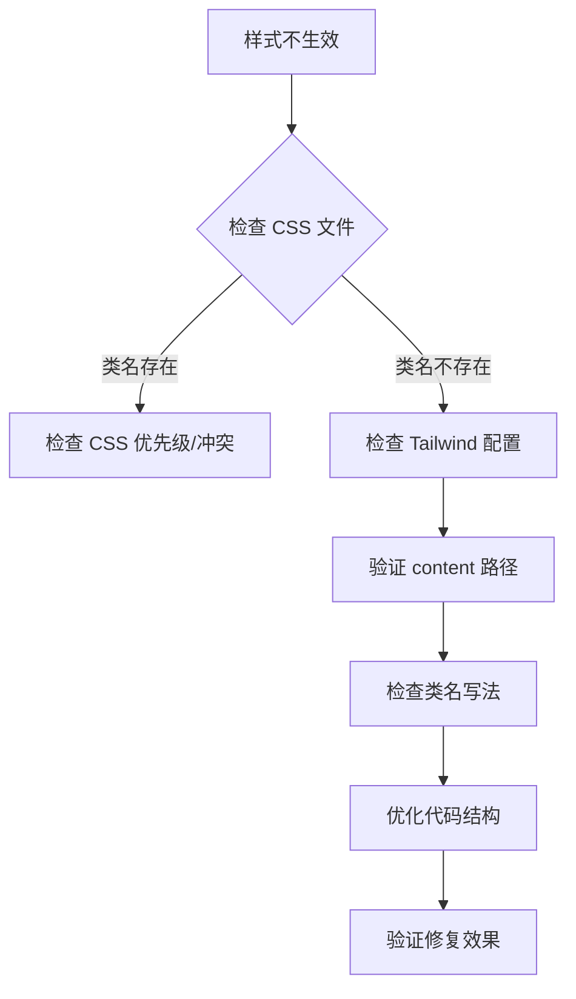

## 🎯 案发现场

某个风和日丽的下午，我正在开发一个基于 pnpm workspace 的 Monorepo 项目。项目结构看起来很清爽：

```
ac-components/
├── apps/
│   └── playground/          # 开发调试用的应用
├── packages/
│   └── core/               # 核心组件库
│       └── src/components/
│           └── Button.tsx  # 我们的主角
├── tailwind.config.js      # Tailwind 配置
└── postcss.config.mjs      # PostCSS 配置
```

一切看起来都很完美，直到我发现了一个诡异的现象：

**在 playground 中写的 Tailwind 样式正常工作，但是 core 包中的 Button 组件样式部分不生效！只有在 playground 中使用过的类名才会生效！** 🤔

## 🔍 初步侦查

让我们先看看这个"有问题"的 Button 组件：

```tsx
// packages/core/src/components/Button.tsx
export const Button: React.FC<ButtonProps> = ({
  variant = "primary",
  children,
  ...props
}) => {
  const base = "px-4 py-2 rounded-lg font-medium transition-colors";
  const styles =
    variant === "primary"
      ? "bg-blue-500 text-white hover:bg-blue-600"
      : "bg-gray-200 text-gray-800 hover:bg-gray-300";

  return (
    <button className={`${base} ${styles}`} {...props}>
      {children}
    </button>
  );
};
```

看起来没问题啊！类名都在那里，Tailwind 配置也包含了正确的路径：

```js
// tailwind.config.js
export default {
  content: [
    "./apps/*/src/**/*.{js,ts,jsx,tsx}",
    "./packages/*/src/**/*.{js,ts,jsx,tsx}", // 这里应该能扫描到 core 包
  ],
  // ...
};
```

但是在浏览器中，只有 `px-4 py-2` 生效了，其他样式全部失踪！这就像是 Tailwind 选择性失明了一样。

## 🕵️‍♀️ 深入调查：CSS 文件的秘密

我决定直接查看编译后的 CSS 文件，看看到底发生了什么：

```bash
curl -s "http://localhost:3001/static/css/index.css" | grep -E "(bg-blue|text-white|rounded)"
```

结果让我大吃一惊：**这些类名根本没有被编译到 CSS 中！**

但是当我在 playground 的代码中直接使用这些类名时：

```tsx
// apps/playground/src/index.tsx
<div className="bg-blue-500 text-white rounded-lg font-medium">测试样式</div>
```

再次检查 CSS 文件，奇迹发生了：

```css
.bg-blue-500 {
  background-color: var(--color-blue-500);
}
.text-white {
  color: var(--color-white);
}
.rounded-lg {
  border-radius: var(--radius-lg);
}
/* ... 其他样式也出现了 */
```

## 💡 真相大白：Tailwind JIT 的"智能"扫描

这时候我恍然大悟！问题出在 **Tailwind CSS 4.x 的 JIT (Just-In-Time) 编译模式**上。

### JIT 模式的工作原理

Tailwind JIT 模式会：

1. 🔍 **静态扫描**所有配置的源文件
2. 🎯 **提取**文件中出现的类名
3. ✨ **按需生成**对应的 CSS 样式

听起来很智能对吧？但是这里有个坑！

### 动态类名的陷阱

我们的 Button 组件使用了这种写法：

```tsx
const base = "px-4 py-2 rounded-lg font-medium transition-colors";
const styles = variant === "primary"
  ? "bg-blue-500 text-white hover:bg-blue-600"
  : "bg-gray-200 text-gray-800 hover:bg-gray-300";

return <button className={`${base} ${styles}`} {...props}>;
```

虽然类名字符串都在源代码中，但是它们被存储在变量里，然后通过模板字符串动态组合。这种写法可能会影响 Tailwind 的静态分析能力！

### 扫描时机的问题

更关键的是，当我们在 playground 中引用 core 包的组件时，如果 playground 本身没有直接使用这些类名，Tailwind 可能在构建时无法正确识别这些"间接引用"的样式。

## 🛠️ 解决方案：让 Tailwind 看得更清楚

基于以上分析，我采用了以下解决策略：

### 1. 优化类名定义方式

将原来的代码重构为更明确的形式：

```tsx
export const Button: React.FC<ButtonProps> = ({
  variant = "primary",
  children,
  ...props
}) => {
  // 🎯 关键改进：将类名更明确地定义为独立变量
  const baseClasses = "px-4 py-2 rounded-lg font-medium transition-colors";
  const primaryClasses = "bg-blue-500 text-white hover:bg-blue-600";
  const secondaryClasses = "bg-gray-200 text-gray-800 hover:bg-gray-300";

  const className =
    variant === "primary"
      ? `${baseClasses} ${primaryClasses}`
      : `${baseClasses} ${secondaryClasses}`;

  return (
    <button className={className} {...props}>
      {children}
    </button>
  );
};
```

### 2. 验证扫描效果

通过以下步骤验证修复效果：

1. **添加测试类名**到 playground 中，确认 Tailwind 能够正常工作
2. **检查 CSS 输出**，确认所需类名被正确编译
3. **移除测试代码**，验证 core 包中的类名是否仍然有效

## 🧪 实验验证

让我们来验证一下修复效果：

```bash
# 检查编译后的 CSS 是否包含我们需要的类名
curl -s "http://localhost:3001/static/css/index.css" | grep -E "(bg-blue-500|rounded-lg|font-medium)"
```

结果：✅ 所有样式都被正确编译了！

## 🎓 经验总结

### 关键学习点

1. **理解 JIT 模式的工作机制**

   - Tailwind JIT 依赖静态代码分析
   - 动态组合的类名可能影响扫描效果
   - Monorepo 中的间接引用需要特别注意

2. **最佳实践建议**

   - 尽量让类名在源代码中"显而易见"
   - 避免过度复杂的动态类名组合
   - 在 Monorepo 中要确保所有包的类名都能被正确扫描

3. **调试技巧**
   - 直接检查编译后的 CSS 文件
   - 使用简单的测试类名验证扫描机制
   - 逐步排除问题范围

### 通用解决思路

遇到类似问题时，可以按以下步骤排查：



## 🎉 后记

这次排查让我深刻理解了现代 CSS 框架的工作原理，特别是 JIT 编译模式的特点。有时候，看似简单的问题背后可能隐藏着复杂的机制。

**记住：工具很智能，但不是魔法。理解工具的工作原理，才能更好地驾驭它们！** ✨

## 🔗 相关资源

- [Tailwind CSS JIT 模式文档](https://tailwindcss.com/docs/just-in-time-mode)
- [Monorepo 最佳实践](https://monorepo.tools/)
- [PostCSS 配置指南](https://postcss.org/docs/)

## 📝 技术栈

- **构建工具**: Rsbuild
- **包管理**: pnpm workspace
- **样式框架**: Tailwind CSS 4.x
- **前端框架**: React + TypeScript
